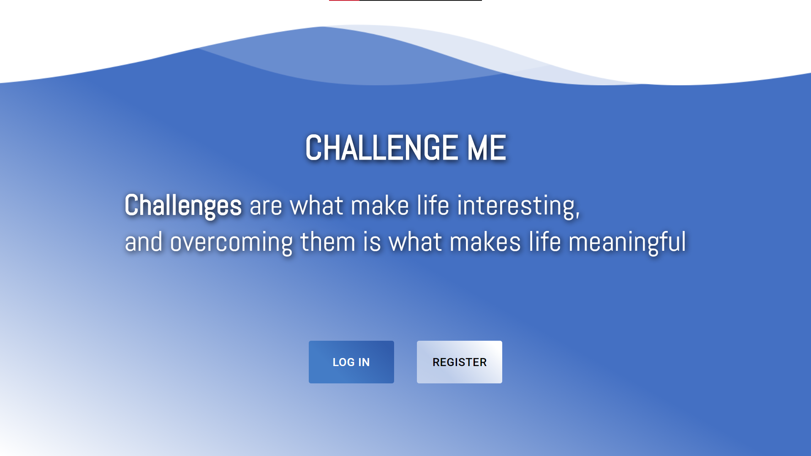
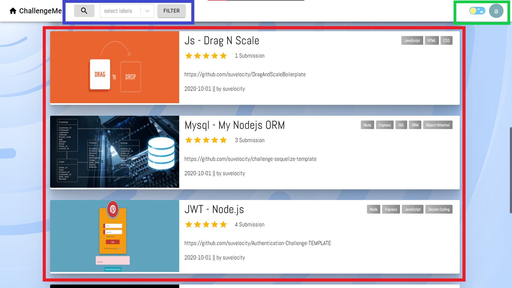
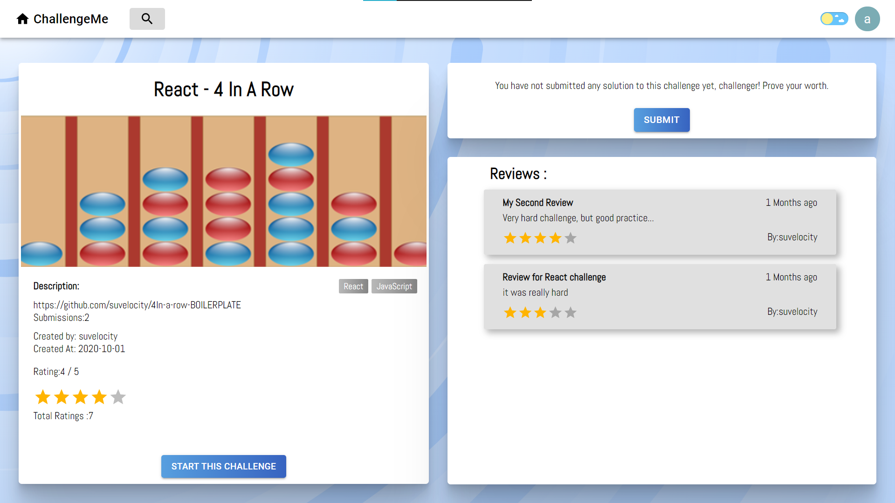
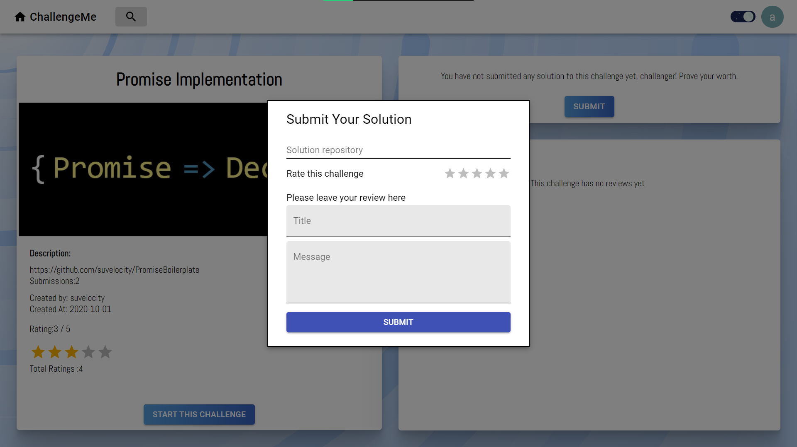
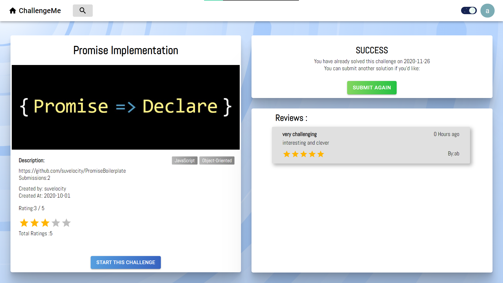

Test-based, Open-Source code learning platform.
## Table of contents
- [Features](#features)
- [Getting Started](#Getting-Started)
  - [Signing up](#Signup)
  - [Find a Challenge](#Finding-a-Challenge)
  - [Start a Challenge](#Starting-a-Challenge)
  - [Submit a Solution](#Submitting-a-Solution)
- [Guides](#guides)
- [About](#About)
- [Contact us!](#contact)

## Features
- Learn to Code and Solve diverse test based challenges
- Actively practice git flow and automated code testing as part of the code learning experience
- Manage assignments, submission's and progress for your students, all in site.
- Build and Share your own challenges, for your students and the world

## Getting Started
### Signup
In order to start using ChallengeMe
Head on to the [Site](http://34.123.35.48:8080/) and sign up. 
 
You'll receive an Email asking you to confirm and once you do you'll be able to log into the site.
### Finding a Challenge
When entering the site for the first Time, what you'll see will resemble this:

🟢 Green is for options and your profile.  
🔴 In Red is the main challenge feed, showing all the challenges.  You Can pick one if you'd like.  
🔵 In Blue are Search and Filters. You can look for a Challenge by its name or find challenges with certain topic by using the filter by label system.
### Starting a Challenge
Once you've clicked a challenge you'll see its details- like whho uploaded it and when it was last updated, as well as its ratings and reviews.
You can also see you have not yet solved it. Better get to it!  

Click the big blue "START THIS CHALLENGE" button.  
This Should lead you to the challenge "boilerplate" repository on GitHub. Should look something like this:

This is the template you'll use to start solving the challenge.  
It will usually include:
1. **Setup**- instructions on how to set the challenge up on you computer

1. **Requirements**- instructions on the requirements for completing the challenge

1.  **Template**- often there will be something to start off from, to save you time and busywork.

1.  **Tests**- the same tests used later to check your submission are included and can be run by you to test as you work  

Clone the Boilerplate to your computer and follow the instructions in the repository to start the challenge.
### Submitting a Solution
Once you have completed the challenge and you pass the tests with flying colours, it's time to submit your Solution.  
First make sure your solution repository is set up to be **public**.  
Head Back to [ChallengeMe](http://34.123.35.48:8080/) and find the challenge you have solved, and click "SUBMIT".

Fields:
- Solution repository: enter the end of the url in the following format: `username/solution-repository-name`.  The format is important the repo must be valid and public, else you won't be able to submit the solution.
- Rate the Challenge ⭐⭐⭐⭐⭐
- Kindly leave a review with constructive criticism.

Once you submit the Solution will be tested with tests Similar to those you had to use during development.  You can go to the [Actions tab](https://github.com/suvelocity/challengeme/actions) to see them happen in real time. if they fail you can also see why, same as you can locally.
If something isn't working as expected, consult the [troubleshooting page](pages/troubleshooting.md)
<!-- TODO -->

Once the tests have passed you can see the status has updated automatically. 
You have completed that challenge and that is yours forever.  
Go and tell your friends!

## Guides
- Create your own challenges
- ChallengeMe for Teachers 
<!-- TODO -->
- [Contribution Guide](pages/setup.md)
## About
## Contact us